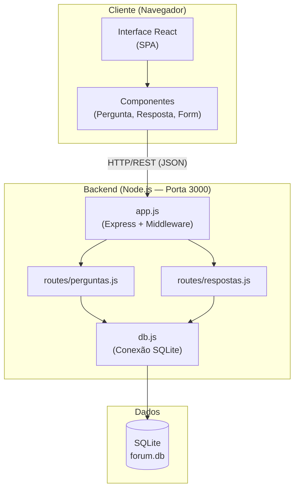

# Análise Arquitetural — ESM Forum

## a) Identificação da Arquitetura

### Estilo Arquitetural

O ESM Forum segue dois estilos arquiteturais complementares:

**1. Arquitetura em Camadas (Layered Architecture)**
O sistema está organizado em camadas lógicas com responsabilidades distintas:

| Camada | Responsabilidade | Tecnologia |
|---|---|---|
| Apresentação | Interface com o usuário | React (SPA) |
| Comunicação | API RESTful | HTTP/JSON |
| Aplicação | Rotas e lógica de controle | Express.js |
| Dados | Persistência | SQLite |

**2. Arquitetura Cliente-Servidor**
O frontend (React) e o backend (Node.js/Express) são processos separados que se comunicam via HTTP. O frontend é uma SPA (*Single Page Application*) que consome a API REST do backend.

---

### Camadas Identificadas

**Camada de Apresentação (Frontend — React)**
- Renderiza a interface gráfica no navegador
- Gerencia estado local dos componentes
- Faz chamadas HTTP à API usando `fetch`
- Executa em: `http://localhost:3001`

**Camada de Aplicação (Backend — Express)**
- Recebe e roteia requisições HTTP
- Executa queries SQL no banco de dados
- Retorna respostas em formato JSON
- Executa em: `http://localhost:3000`

**Camada de Dados (SQLite)**
- Armazena perguntas e respostas
- Banco de dados de arquivo único (`forum.db`)
- Acessado diretamente pelas rotas via módulo `db.js`

---

### Comunicação Frontend ↔ Backend

O frontend e o backend se comunicam exclusivamente via **HTTP/REST**:

- Frontend faz requisições `GET`, `POST`, `DELETE` para a API
- Backend responde com JSON
- Não há websockets, GraphQL ou gRPC no sistema atual
- CORS está configurado no backend para permitir requisições do frontend

**Exemplo de fluxo:**
```
React (porta 3001)
  → fetch('http://localhost:3000/perguntas')
    → Express router (routes/perguntas.js)
      → SQLite (db.all('SELECT * FROM perguntas'))
        → retorna JSON ao React
```

---

## b) Diagrama Arquitetural



---

*Documento preparado para o Projeto Final de Engenharia de Software — Parte 3, Iteração 3.*
