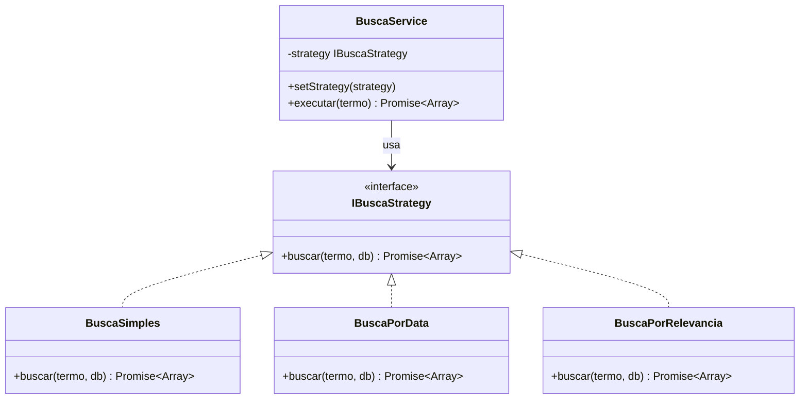
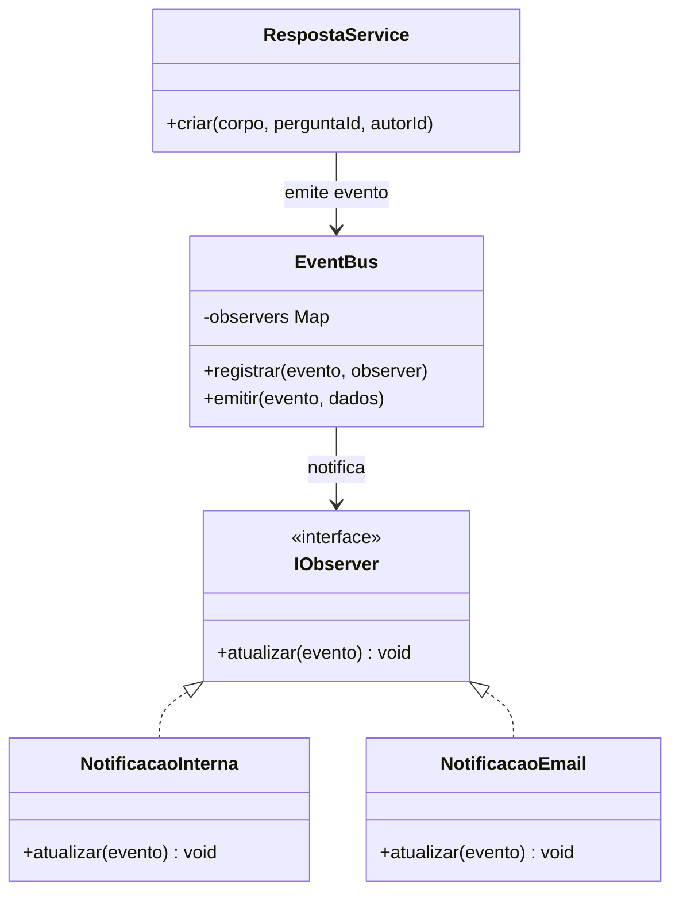
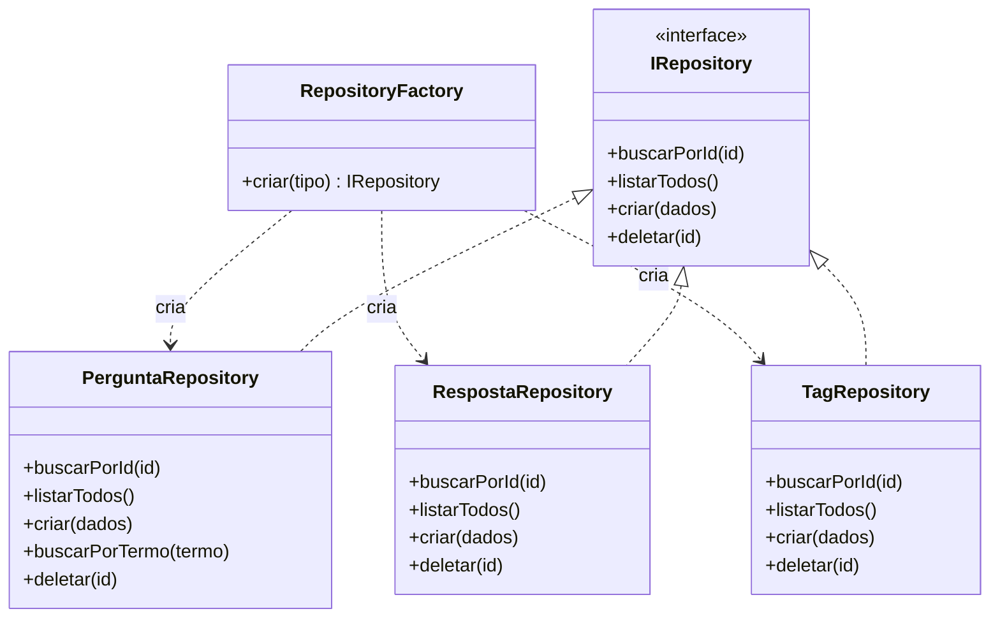

# Propostas de Padrões de Projeto — ESM Forum

## Introdução

Esta seção propõe a aplicação de três padrões de projeto clássicos nas funcionalidades do ESM Forum, justificando a escolha de cada um, descrevendo a implementação e ilustrando com exemplos de código.

---

## Padrão 1: Strategy — Funcionalidade de Busca

### a) Justificativa e Contexto

**Funcionalidade:** Busca de perguntas por palavra-chave

**Problema que resolve:**
O sistema de busca atual executa apenas um tipo de estratégia de filtragem (LIKE no banco). À medida que o sistema cresce, surgem necessidades como: busca por relevância, busca por data, busca full-text, ou até integração com um motor de busca externo. Sem o padrão Strategy, cada nova forma de busca exigiria alterações no código existente.

**Por que Strategy é adequado:**
O padrão Strategy define uma família de algoritmos, encapsula cada um e os torna intercambiáveis. Isso permite variar a estratégia de busca independentemente dos clientes que a utilizam — mantendo o OCP (Open/Closed Principle). O `BuscaService` pode selecionar a estratégia em tempo de execução com base em parâmetros da requisição.

---

### b) Proposta de Solução

**Classes/módulos a criar:**

- `IBuscaStrategy` — interface (contrato) que toda estratégia deve implementar
- `BuscaSimples` — busca por LIKE no banco (estratégia padrão)
- `BuscaPorData` — ordena por data de criação
- `BuscaPorRelevancia` — futuro: integração com busca full-text
- `BuscaService` — contexto que usa a estratégia selecionada

**Como interagem:**
O `BuscaController` recebe o parâmetro `modo` da requisição (ex: `?modo=data`) e passa para o `BuscaService`, que seleciona e executa a estratégia correspondente.

**Diagrama de Classes (Mermaid):**



---

### c) Exemplo de Código

```js
// strategies/IBuscaStrategy.js — contrato
class IBuscaStrategy {
  buscar(termo, db) {
    throw new Error('Método buscar() não implementado');
  }
}

// strategies/BuscaSimples.js — estratégia padrão
class BuscaSimples extends IBuscaStrategy {
  buscar(termo, db) {
    return new Promise((resolve, reject) => {
      const param = `%${termo}%`;
      db.all(
        `SELECT * FROM perguntas
         WHERE LOWER(titulo) LIKE LOWER(?) OR LOWER(corpo) LIKE LOWER(?)
         ORDER BY id DESC`,
        [param, param],
        (err, rows) => { if (err) reject(err); else resolve(rows); }
      );
    });
  }
}

// strategies/BuscaPorData.js — estratégia alternativa
class BuscaPorData extends IBuscaStrategy {
  buscar(termo, db) {
    return new Promise((resolve, reject) => {
      const param = `%${termo}%`;
      db.all(
        `SELECT * FROM perguntas
         WHERE LOWER(titulo) LIKE LOWER(?) OR LOWER(corpo) LIKE LOWER(?)
         ORDER BY criado_em DESC`,
        [param, param],
        (err, rows) => { if (err) reject(err); else resolve(rows); }
      );
    });
  }
}

// services/BuscaService.js — contexto com injeção de estratégia
class BuscaService {
  constructor(strategy) {
    this.strategy = strategy;
  }

  setStrategy(strategy) {
    this.strategy = strategy;
  }

  async executar(termo) {
    if (!termo || termo.trim().length < 2) {
      throw new Error('Termo de busca muito curto');
    }
    return this.strategy.buscar(termo.trim(), db);
  }
}

// controllers/BuscaController.js — seleciona a estratégia em runtime
const estrategias = {
  simples: new BuscaSimples(),
  data: new BuscaPorData(),
};

class BuscaController {
  async buscar(req, res) {
    try {
      const { q, modo = 'simples' } = req.query;
      const strategy = estrategias[modo] || estrategias.simples;
      const service = new BuscaService(strategy);
      const resultados = await service.executar(q);
      res.json(resultados);
    } catch (err) {
      res.status(400).json({ error: err.message });
    }
  }
}
```

---

## Padrão 2: Observer — Funcionalidade de Notificações

### a) Justificativa e Contexto

**Funcionalidade:** Notificação de novas respostas às perguntas do usuário

**Problema que resolve:**
Quando uma resposta é postada, o sistema precisa notificar o autor da pergunta. Sem Observer, a rota de criação de resposta teria que chamar diretamente o módulo de notificação — criando acoplamento forte. Se amanhã quiser também enviar email, registrar em log e atualizar um contador, a rota de resposta ficaria sobrecarregada de responsabilidades.

**Por que Observer é adequado:**
O padrão Observer define uma dependência um-para-muitos: quando um objeto (subject) muda de estado, todos os seus dependentes (observers) são notificados automaticamente. Isso desacopla o módulo de respostas dos mecanismos de notificação, seguindo o SRP e o OCP.

---

### b) Proposta de Solução

**Classes/módulos a criar:**

- `EventEmitter` (Node.js nativo) — subject/publisher
- `NotificacaoInterna` — observer que salva notificação no banco
- `NotificacaoEmail` — observer futuro para envio de email
- `RespostaService` — emite o evento ao criar uma resposta

**Diagrama de Classes (Mermaid):**



---

### c) Exemplo de Código

```js
// events/EventBus.js — gerenciador de eventos (subject)
class EventBus {
  constructor() {
    this.observers = {};
  }

  registrar(evento, observer) {
    if (!this.observers[evento]) this.observers[evento] = [];
    this.observers[evento].push(observer);
  }

  emitir(evento, dados) {
    (this.observers[evento] || []).forEach(obs => obs.atualizar(dados));
  }
}

module.exports = new EventBus(); // Singleton

// observers/NotificacaoInterna.js
class NotificacaoInterna {
  atualizar({ perguntaId, autorResposta, autorPergunta }) {
    db.run(
      `INSERT INTO notificacoes (usuario_id, mensagem, lida)
       VALUES (?, ?, 0)`,
      [autorPergunta, `${autorResposta} respondeu sua pergunta #${perguntaId}`]
    );
    console.log(`[Notificação] Usuário ${autorPergunta} notificado.`);
  }
}

// services/RespostaService.js — emite evento ao criar resposta
const eventBus = require('../events/EventBus');

class RespostaService {
  async criar(corpo, perguntaId, autorId) {
    // 1. Persiste a resposta
    const id = await respostaRepository.criar(corpo, perguntaId, autorId);

    // 2. Busca o autor da pergunta
    const pergunta = await perguntaRepository.buscarPorId(perguntaId);

    // 3. Emite evento — os observers cuidam do resto
    eventBus.emitir('resposta.criada', {
      perguntaId,
      autorResposta: autorId,
      autorPergunta: pergunta.autor_id,
    });

    return id;
  }
}

// app.js — registra os observers na inicialização
const eventBus = require('./events/EventBus');
const NotificacaoInterna = require('./observers/NotificacaoInterna');
eventBus.registrar('resposta.criada', new NotificacaoInterna());
// Para adicionar email: eventBus.registrar('resposta.criada', new NotificacaoEmail());
```

---

## Padrão 3: Factory — Criação de Repositórios

### a) Justificativa e Contexto

**Funcionalidade:** Criação de objetos de acesso a dados para as diferentes entidades (Pergunta, Resposta, Tag, Voto)

**Problema que resolve:**
À medida que o sistema cresce com novas funcionalidades (Tags, Votos, Notificações), surgem múltiplos repositórios a serem instanciados. Sem um Factory, cada controller ou service precisaria saber como construir seu repositório — violando o DIP e dificultando testes.

**Por que Factory é adequado:**
O padrão Factory centraliza a lógica de criação de objetos, desacoplando os consumidores das implementações concretas. Facilita a troca de implementações (ex: SQLite → PostgreSQL) em um único ponto, e simplifica a criação de mocks para testes unitários.

---

### b) Proposta de Solução

**Classes/módulos a criar:**

- `RepositoryFactory` — fábrica central que instancia repositórios
- `PerguntaRepository`, `RespostaRepository`, `TagRepository`, `VotoRepository` — implementações concretas
- `IRepository` — interface base

**Diagrama de Classes (Mermaid):**



---

### c) Exemplo de Código

```js
// factories/RepositoryFactory.js
const PerguntaRepository = require('../repositories/PerguntaRepository');
const RespostaRepository = require('../repositories/RespostaRepository');
const TagRepository = require('../repositories/TagRepository');
const VotoRepository = require('../repositories/VotoRepository');

const repositorios = {
  pergunta: PerguntaRepository,
  resposta: RespostaRepository,
  tag: TagRepository,
  voto: VotoRepository,
};

class RepositoryFactory {
  static criar(tipo) {
    const Repo = repositorios[tipo];
    if (!Repo) throw new Error(`Repositório '${tipo}' não encontrado.`);
    return new Repo();
  }
}

module.exports = RepositoryFactory;

// Uso em um service — o service não conhece a implementação concreta
const factory = require('../factories/RepositoryFactory');

class TagService {
  constructor() {
    this.tagRepo = RepositoryFactory.criar('tag');
    this.perguntaRepo = RepositoryFactory.criar('pergunta');
  }

  async associarTag(perguntaId, tagNome) {
    const pergunta = await this.perguntaRepo.buscarPorId(perguntaId);
    if (!pergunta) throw new Error('Pergunta não encontrada');
    return this.tagRepo.associar(perguntaId, tagNome);
  }
}

// Para testes: mock factory — sem alterar nenhum service
RepositoryFactory.criar = (tipo) => ({
  buscarPorId: jest.fn().mockResolvedValue({ id: 1, titulo: 'Pergunta mock' }),
  listarTodos: jest.fn().mockResolvedValue([]),
  criar: jest.fn().mockResolvedValue({ id: 99 }),
});
```

---

## Resumo dos Padrões Propostos

| Padrão | Categoria | Funcionalidade | Benefício Principal |
|---|---|---|---|
| **Strategy** | Comportamental | Busca | Algoritmos de busca intercambiáveis sem modificar código existente |
| **Observer** | Comportamental | Notificações | Desacoplamento entre criação de respostas e mecanismos de notificação |
| **Factory** | Criacional | Acesso a dados | Centraliza criação de repositórios, facilita testes e troca de banco |

---

*Documento preparado para o Projeto Final de Engenharia de Software — Parte 3, Iteração 2.*
