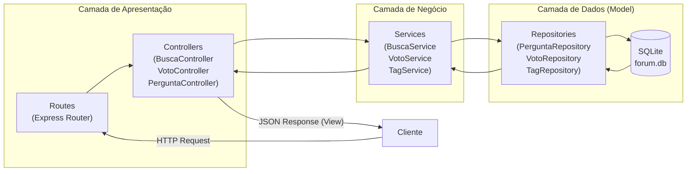

# Proposta de Organização Arquitetural — ESM Forum

## Introdução

A arquitetura atual do ESM Forum concentra toda a lógica (rotas HTTP, validação, queries SQL) dentro dos arquivos de rota. Esta proposta apresenta uma reorganização em camadas bem definidas e a aplicação do padrão MVC, tornando o sistema mais manutenível, testável e extensível.

---

## a) Proposta de Separação em Camadas

### Estrutura de Diretórios Proposta

```
backend/
├── routes/            ← Camada de Apresentação (API)
│   ├── perguntas.js
│   ├── respostas.js
│   ├── busca.js
│   ├── tags.js
│   └── votos.js
├── controllers/       ← Camada de Apresentação (Controllers)
│   ├── PerguntaController.js
│   ├── RespostaController.js
│   ├── BuscaController.js
│   └── VotoController.js
├── services/          ← Camada de Negócio
│   ├── PerguntaService.js
│   ├── BuscaService.js
│   ├── VotoService.js
│   └── TagService.js
├── repositories/      ← Camada de Dados
│   ├── PerguntaRepository.js
│   ├── RespostaRepository.js
│   ├── TagRepository.js
│   └── VotoRepository.js
├── models/            ← Modelos de domínio
│   ├── Pergunta.js
│   └── Resposta.js
├── middleware/        ← Middlewares transversais
│   ├── errorHandler.js
│   └── validacao.js
├── db.js
└── app.js
```

---

### Camada de Apresentação — `routes/` + `controllers/`

**Responsabilidades:**
- Receber requisições HTTP e extrair parâmetros (`req.body`, `req.params`, `req.query`)
- Delegar o processamento para os Services
- Formatar e retornar a resposta HTTP com o status correto
- Tratar erros HTTP (400, 404, 500)

**Não deve conter:** queries SQL, regras de negócio, validações de domínio

**Exemplos de módulos:**
- `PerguntaController` — controla fluxo de criar/listar/deletar perguntas
- `BuscaController` — controla fluxo de busca com seleção de estratégia
- `VotoController` — controla fluxo de registrar e remover votos

**Como se comunica:**
Recebe do roteador Express e chama o Service correspondente, retornando o resultado como JSON.

---

### Camada de Negócio — `services/`

**Responsabilidades:**
- Implementar as regras de negócio da aplicação
- Validar entradas de negócio (ex: "um usuário não pode votar duas vezes na mesma pergunta")
- Orquestrar chamadas a múltiplos repositórios quando necessário
- Emitir eventos de domínio (Observer)

**Não deve conter:** queries SQL, código HTTP, detalhes de banco de dados

**Exemplos de módulos:**
- `BuscaService` — aplica Strategy de busca, valida tamanho do termo
- `VotoService` — verifica voto duplicado, calcula pontuação, persiste voto
- `TagService` — valida limite de 3 tags por pergunta, associa tags

**Como se comunica:**
Recebe dados do Controller e chama o Repository para persistência.

---

### Camada de Dados — `repositories/`

**Responsabilidades:**
- Executar queries SQL no banco de dados
- Traduzir resultados do banco em objetos de domínio
- Isolar a aplicação dos detalhes do SQLite

**Não deve conter:** regras de negócio, validações, lógica HTTP

**Exemplos de módulos:**
- `PerguntaRepository` — CRUD de perguntas + busca por termo
- `VotoRepository` — registrar, remover e consultar votos por usuário e pergunta
- `TagRepository` — criar tags e associar a perguntas

**Como se comunica:**
Recebe parâmetros dos Services e executa queries no banco via `db.js`.

---

### Comunicação entre Camadas

```
Requisição HTTP
  → Route (Express)
    → Controller (extrai parâmetros, chama service)
      → Service (valida, aplica regras de negócio, chama repository)
        → Repository (query SQL → SQLite)
        ← Repository (retorna dados)
      ← Service (retorna objeto de domínio)
    ← Controller (formata resposta)
  ← Route (resposta HTTP JSON)
```

---

## b) Proposta de Aplicação do Padrão MVC

### Visão Geral do MVC no Backend

No contexto de uma API REST em Node.js/Express, o MVC é adaptado da seguinte forma:

| Componente | Responsabilidade | Localização |
|---|---|---|
| **Model** | Estrutura dos dados e acesso ao banco | `repositories/` + `models/` |
| **View** | Formatação da resposta JSON | `controllers/` (método de resposta) |
| **Controller** | Orquestração do fluxo de requisição | `controllers/` |

---

### MVC Aplicado: Funcionalidade de Busca

**Model — `PerguntaRepository.js`**
```js
class PerguntaRepository {
  // Modela os dados de perguntas e operações sobre eles
  buscarPorTermo(termo) {
    return new Promise((resolve, reject) => {
      db.all(
        `SELECT id, titulo, corpo, autor, criado_em
         FROM perguntas
         WHERE LOWER(titulo) LIKE LOWER(?) OR LOWER(corpo) LIKE LOWER(?)
         ORDER BY id DESC`,
        [`%${termo}%`, `%${termo}%`],
        (err, rows) => { if (err) reject(err); else resolve(rows); }
      );
    });
  }
}
```

**Controller — `BuscaController.js`**
```js
class BuscaController {
  async buscar(req, res) {
    // Orquestra o fluxo: recebe, valida, chama service, retorna view
    try {
      const { q } = req.query;
      const resultados = await buscaService.buscarPerguntas(q);
      // View: formata a resposta JSON
      res.json({
        sucesso: true,
        total: resultados.length,
        dados: resultados,
      });
    } catch (err) {
      res.status(400).json({ sucesso: false, erro: err.message });
    }
  }
}
```

**View (resposta JSON formatada):**
```json
{
  "sucesso": true,
  "total": 2,
  "dados": [
    {
      "id": 3,
      "titulo": "Como usar async/await no Node.js?",
      "corpo": "Tenho dúvidas sobre como lidar com erros...",
      "autor": "Carlos",
      "criado_em": "2024-10-15T14:30:00Z"
    }
  ]
}
```

---

### MVC Aplicado: Funcionalidade de Votação

**Model — `VotoRepository.js`**
```js
class VotoRepository {
  // Modela os dados de votos e operações sobre eles
  async registrar(usuarioId, perguntaId, tipo) {
    return new Promise((resolve, reject) => {
      db.run(
        `INSERT INTO votos (usuario_id, pergunta_id, tipo) VALUES (?, ?, ?)`,
        [usuarioId, perguntaId, tipo],
        function (err) { if (err) reject(err); else resolve({ id: this.lastID }); }
      );
    });
  }

  async buscarVotoExistente(usuarioId, perguntaId) {
    return new Promise((resolve, reject) => {
      db.get(
        `SELECT * FROM votos WHERE usuario_id = ? AND pergunta_id = ?`,
        [usuarioId, perguntaId],
        (err, row) => { if (err) reject(err); else resolve(row); }
      );
    });
  }
}
```

**Controller — `VotoController.js`**
```js
class VotoController {
  async votar(req, res) {
    try {
      const { perguntaId } = req.params;
      const { usuarioId, tipo } = req.body; // 'up' ou 'down'
      const resultado = await votoService.registrarVoto(usuarioId, perguntaId, tipo);
      // View
      res.json({
        sucesso: true,
        novaContagem: resultado.novaContagem,
        tipoVoto: tipo,
      });
    } catch (err) {
      const status = err.message.includes('já votou') ? 409 : 400;
      res.status(status).json({ sucesso: false, erro: err.message });
    }
  }
}
```

---

### Fluxo Completo: Requisição → Resposta (Votação)

```
1. Cliente envia: POST /votos/perguntas/5
   Body: { "usuarioId": 12, "tipo": "up" }

2. Route (votos.js):
   router.post('/perguntas/:perguntaId', votoController.votar)

3. VotoController.votar():
   - Extrai perguntaId=5, usuarioId=12, tipo='up'
   - Chama votoService.registrarVoto(12, 5, 'up')

4. VotoService.registrarVoto():
   - Verifica se usuário 12 já votou na pergunta 5
   - Se sim: lança erro "Usuário já votou nesta pergunta"
   - Se não: chama votoRepository.registrar(12, 5, 'up')
   - Recalcula e retorna nova contagem

5. VotoRepository.registrar():
   - Executa INSERT INTO votos...
   - Retorna { id: 99 }

6. Controller recebe resultado e monta a View (JSON):
   { "sucesso": true, "novaContagem": 7, "tipoVoto": "up" }

7. Cliente recebe resposta HTTP 200 com o JSON
```

---

### Diagrama MVC Proposto



---

*Documento preparado para o Projeto Final de Engenharia de Software — Parte 3, Iteração 3.*
